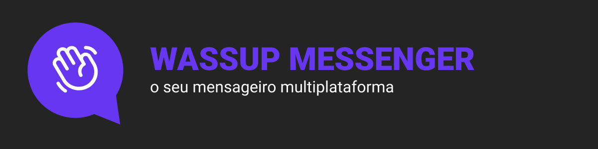
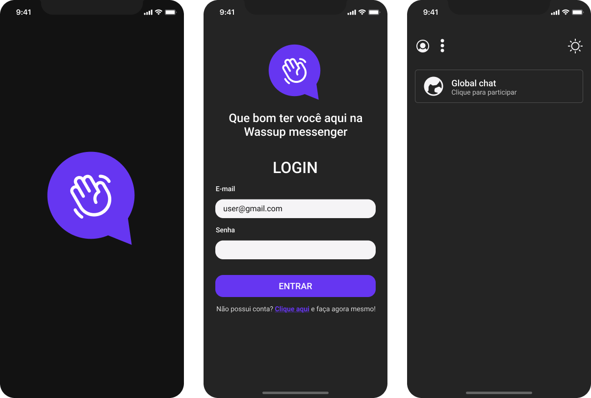

<h1 align="center">
  
</h1>

<h2> O que é esse projeto? </h2>

 
  Wassup Messenger é um mensageiro multiplataforma (mobile e web). Através dele
  é possível se conectar ao chat da plataforma e conversar com diversos usuários simultâneamente, o único requisito é possuir uma conta. Confira a versão mobile <a href="https://github.com/Th-Fernandes/Wassup-messenger-mobile">aqui</a>

  <h2>Como utilizar</h2>
  <ol>
    <li>Faça o download <a href="https://drive.google.com/drive/folders/1eVA2yf4yIIgW2SoYwxyAI_ZZ4FB_8UET?usp=share_link">clicando aqui</a></li>
    <li>clique em "Não possui conta? clique aqui para criar" para abrir o formulário de cadastro</li>
    <li>informe nome de usuário, email e senha no formulário e após confirme o cadastro no email informado.</li>
    <li>Retorne na  <a href="https://wassup-messenger.vercel.app/">url principal da aplicação</a> e informe o email e senha cadastrados</li>
  </ol>

  <h2>Design no figma</h2>

  
A Ui desse projeto foi desenhada do zero. Para Acessar seu desenvolvimento no figma, basta <a href="https://www.figma.com/file/HV7Z85nESpCqSTltB00Xc9/wassup-messenger?node-id=0%3A1&t=M62eBpRaUwla8J9F-1">acessar esse link.</a>

  

  

  <h2>Ferramentas utilizadas (versão Mobile)</h2>
  <ul>
    <li>Expo</li>
    <li>React Native</li>
    <li>Typescript</li>
    <li>Phosphor</li>
    <li>Supabase</li>
  </ul>

## Autor

